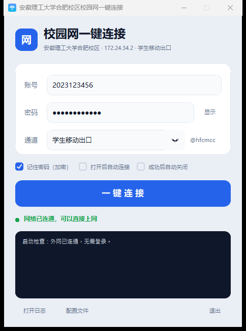

# aust-hefei-campus-login

One-click login for the AUST Hefei campus network.



The campus portal runs Dr.COM's eportal stack. Rather than driving a browser through
the login form, this talks to the portal's own JSONP endpoint directly, so a session
comes up in about a second instead of ten to thirty.

Credentials are entered once and kept locally, encrypted with Windows DPAPI.

---

> ## Beta
>
> This is a personal utility, published as-is. It has only ever been exercised against
> a single portal deployment, on a single machine, and campus networks get reconfigured
> without warning. Expect rough edges, and don't depend on it for anything that matters.
> If it breaks, the log file will usually say why — patches are welcome.

---

## Scope

Written for the **Hefei campus**: portal `172.24.34.2`, student mobile egress (`@hfcmcc`).

It does **not** apply to the Huainan campus. That campus runs a different portal
(`10.255.0.19` at the time of writing) with a different set of egress suffixes, and is
unreachable from the Hefei network. Passing these parameters over there will not work.

The interface is in Chinese, which is what the intended users read.

## Requirements

- Windows 10 or 11
- Python 3.9+ to run from source, or nothing at all to run the packaged build
- `customtkinter` for the GUI

## Running it

```bash
pip install -r requirements.txt
python aust_campus.py
```

Fill in your student ID, password and egress once. After that the window opens with the
fields already populated and a single button does the rest.

To build a standalone executable:

```powershell
pip install pyinstaller customtkinter

# Directory build — faster start, recommended for installing locally
pyinstaller --noconfirm --onedir --noconsole --name AUSTHFCampus `
    --collect-all customtkinter `
    --exclude-module numpy --exclude-module scipy --exclude-module pandas `
    aust_campus.py
```

The `--exclude-module` flags are not optional in practice. Pillow declares numpy as an
optional dependency, and if numpy happens to be installed, PyInstaller will pull it —
along with its bundled OpenBLAS — into the output. That turns a 15 MB build into a 73 MB
one for no benefit.

### Command line

| Flag | Effect |
| --- | --- |
| *(none)* | Open the window |
| `--silent` | Authenticate without showing a window; suitable for a scheduled task |
| `--check` | Report network state and exit. Sends no authentication request |
| `--dry-run` | Print the request that would be sent, without sending it |
| `--force` | Re-authenticate even when the connection is already up |

## How it works

A session is one GET against the portal's JSONP endpoint:

```
GET http://172.24.34.2:801/eportal/portal/login
      ?callback=dr1003
      &login_method=1
      &user_account=,0,<student-id><egress>     # ,0, desktop prefix — ,1, on mobile
      &user_password=<password>
      &wlan_user_ip=<local campus address>
      &wlan_user_ipv6=
      &wlan_user_mac=000000000000
      &wlan_ac_ip=
      &wlan_ac_name=
      &jsVersion=4.2
      &lang=zh
```

The reply is `dr1003({"result":1,...})`. A `result` of `1` or `ok` means the session is
up; `ret_code: 2`, meaning the address was already online, is treated the same way.

None of this is guesswork. Every parameter was read out of the JavaScript the portal
hands to browsers:

- `a41.js` defines `portal_api`, the terminal probe and the page loader
- `a40.js` holds `login.login_portal()`, where the request is assembled
- the active scheme page, `extern/<program_index>/<page_index>/pc.js`, carries the
  egress dropdown

That dropdown is the source of the egress suffix:

```html
<select name="ISP_select">
  <option value="-1">Select egress</option>
  <option value="">Campus resources only</option>
  <option value="@aust">China Telecom</option>
  <option value="@hfcmcc">China Mobile (Hefei)</option>
</select>
```

A second endpoint, `drcom/chkstatus`, returns the machine's own address on the campus
network. That address is read at runtime, so a new DHCP lease needs no configuration
change.

### Detecting an existing session

`chkstatus` is not a reliable indicator of connectivity on this deployment — it reports
`result: 0` on a machine that is demonstrably online — so connectivity is probed over
HTTPS with ordinary certificate validation instead.

The reasoning: an unauthenticated portal can intercept plain HTTP and serve a login page,
but it cannot present a valid certificate for `www.163.com`. A TLS failure therefore
means "not authenticated", with none of the false positives a status-code check produces.
Hosts that the campus whitelists without authentication (`msftncsi.com`,
`captive.apple.com`, `detectportal.firefox.com` and relatives) are deliberately avoided,
since they respond either way.

The practical consequence is that when the machine already has internet access, the tool
sends nothing to the portal at all.

### Design notes

- **No logout path.** The program only ever authenticates. It will not tear down a
  session, and re-running it on a live connection is a no-op.
- **Failures are verbose.** Retries cover transient errors; a password rejected on its
  trailing full-width versus half-width exclamation mark is retried with the other form;
  whatever the portal says is written to the log verbatim.
- **No telemetry.** Nothing leaves the machine except requests to the campus portal and
  the connectivity probes.

## Adapting it to another campus

The same approach works at any campus running Dr.COM eportal. In outline:

1. Connect without authenticating and let the browser land on the login page. Note the
   host and port.
2. Run the probe that ships with this repository:
   ```bash
   python tools/probe_portal.py 10.0.0.1 801
   ```
   It reads `chkstatus` and `loadConfig` and prints the scheme identifiers, the
   authentication method and the account suffix handling. All of it is read-only.
3. Fetch the scheme page named in the output and look for `ISP_select` or `ISP_radio`.
   The `value` attributes are the egress suffixes.
4. Update `PORTAL_HOST`, `PORTAL_PORT` and `CHANNELS` at the top of `aust_campus.py`.

Note that some deployments — including this university's Huainan campus — run an older
Dr.COM build, where login is a form POST to `/a79.htm` or a GET to `/drcom/login`. This
project targets the eportal v4 JSONP interface only.

## Configuration and logs

Both live under `%APPDATA%\CampusNetLogin`:

- `config.json` — account and settings. The password field holds a DPAPI blob, readable
  only by the Windows account that wrote it. With "remember password" unchecked, the
  password is never written to disk.
- `login.log` — a timestamped record of everything the tool did.

## License

[MIT](LICENSE)
